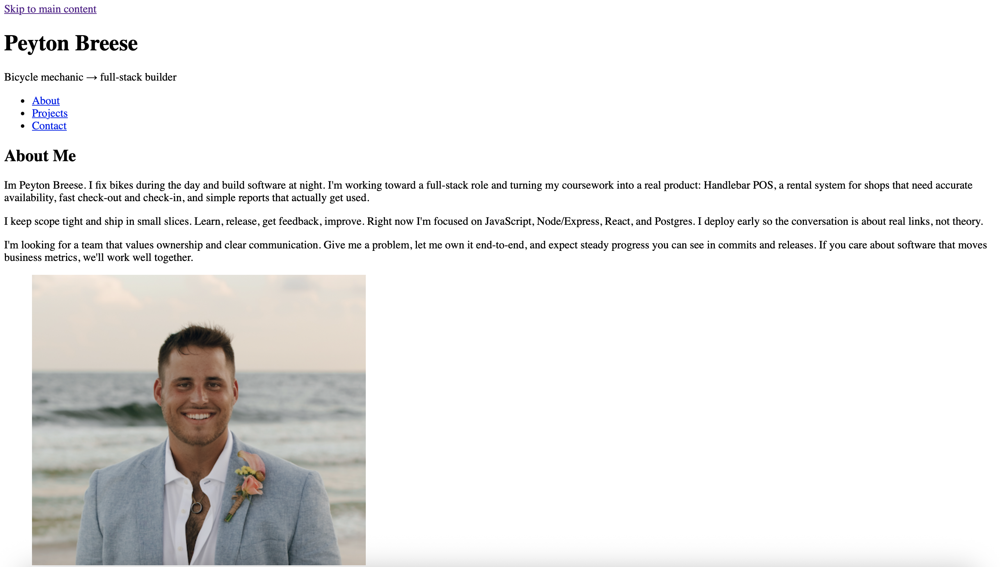

# Peyton Breese — Portfolio (v1.1)

**Live site:** https://breese-peyton.github.io/Portfolio/  
**Repo:** https://github.com/breese-peyton/Portfolio

A small, fast portfolio site with an About section, a Projects list, and simple contact info. First step in my full‑stack journey, updated as I ship new work.

---

## What’s here

- Clean, semantic HTML (header → nav → main → sections → footer)
- Skip‑to‑content link for accessibility
- Logical headings (one 'h1', then 'h2'/'h3')
- Clickable contact links ('mailto:' / 'tel:')
- Placeholder project links for now (to be swapped as apps go live)

> Styling is intentionally light in v1. CSS and JS arrive in v2+ per the roadmap.

---

## Tech

- HTML5  
- (Coming soon) CSS, JavaScript, and small JS apps
- Deployed with GitHub Pages

---

## Structure

```
/
├─ index.html
├─ assets/
│  └─ Peyton.png
└─ README.md
```

> Case matters on the web host. If your folder is 'Assets', don’t reference it as 'assets'.

---

## Run it locally

Open 'index.html' in your browser, or use VS Code’s Live Server extension.

---

## Deploy (GitHub Pages)

Already deployed at: https://breese-peyton.github.io/Portfolio/

If redeploying:
1) Push to GitHub.  
2) Repo → **Settings → Pages**.  
3) **Source:** Deploy from a branch. **Branch:** 'main'. **Folder:** '/ (root)'.  
4) Save and wait ~1–2 minutes.

---

## Roadmap

- **Week 2:** Responsive CSS (Flexbox/Grid), Portfolio v2, Business Landing Page
- **Week 3–4:** JavaScript mini‑apps (Calculator, Quiz, To‑Do with localStorage)
- **Week 5:** Data handling + APIs (Expense Tracker, Weather App)
- **Week 6:** Polish pass, screenshots, consistent READMEs for all projects

---

## Screenshots



---

## Contact

- Email: [peyton@homesavvy.app](mailto:peyton@homesavvy.app)  
- Phone: [(513) 646-6718](tel:+15136466718)

---

## License

MIT — feel free to reference the structure for your own site.
